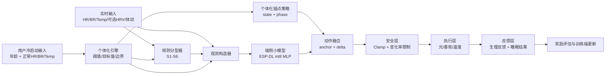

# 个体化睡眠调节算法框架与数据格式

## 1. 目标

本系统面向睡前和入睡早期场景，基于用户的年龄、正常生理基线和实时生理信号，动态调节：

- 光源
- 香氛
- 温度
- 声音
核心目标：

- 缩短入睡时延
- 提升睡眠深度
- 降低微觉醒和夜间唤醒
- 在安全约束下实现个体化调节

## 2. 总体算法框架

当前采用“个体化规则层 + 小模型微调层”的双层结构，而不是直接端到端强化学习。



## 3. 关键设计原则

### 3.1 冷启动个体化

用户首次使用时输入：

- `age`
- `hr_baseline`
- `br_baseline`
- `temp_baseline`
- 可选 `rmssd_baseline`
- 可选 `stillness_baseline`

系统自动生成：

- 个体化分型阈值
- 个体化目标睡前生理区间
- 个体化安全边界
- 个体化锚点动作

### 3.2 分层控制

最终控制不是“模型直接输出所有动作”，而是：

```text
final_action = personalized_anchor_action + tiny_model_delta
```

这样做的好处：

- 保留可解释性
- 降低训练难度
- 便于 ESP32-S3 本地部署
- 更容易做安全约束

### 3.3 训练与部署解耦

- 训练端：PPO / 蒸馏 / 奖励优化
- 设备端：规则分型、个体化参数生成、小模型推理、安全执行

设备端只部署轻量前向推理模型，不部署完整 PPO 训练框架。

## 4. 状态分型设计

当前沿用 6 类睡前状态：

- `S1`：高交感/焦虑
- `S2`：高觉醒/亢奋
- `S3`：中度反刍
- `S4`：平静基准态
- `S5`：低唤醒/疲惫
- `S6`：病理性失眠风险

### 4.1 分型输入

- `HR`
- `BR`
- `Temp`
- 可选 `RMSSD`
- 可选 `BR_irregularity`
- 可选 `stillness`
- 用户年龄
- 7 日基线或首次输入基线

### 4.2 分型输出

- `state`
- `confidence`
- `rationale`

### 4.3 分型逻辑

推荐流程：

1. 先用年龄和基线生成个体化阈值
2. 用规则模型做首轮分型
3. 若特征缺失，则使用 reduced-feature 模式
4. 若置信度低，则回退到 `S4`
5. `S6` 作为硬规则保守模式，不交给端侧模型学习

## 5. 个体化策略生成

个体化引擎根据：

- 年龄段
- 正常 `HR/BR/Temp`
- 敏感度参数

生成 4 类参数：

### 5.1 个体化阈值

用于调整 `S1/S2/S5` 等状态的分型阈值。

### 5.2 个体化目标值

例如：

- `expected_sleep_hr_bpm`
- `expected_sleep_br_bpm`
- `preferred_temp_c`

### 5.3 个体化锚点动作

不同年龄和基线用户的基础动作参数不同，例如：

- 高龄用户温度变化更缓
- 对香氛敏感的用户香氛强度更低
- 平静型用户灯光变化更温和

### 5.4 个体化安全边界

例如：

- `max_temp_step_c`
- `max_aroma_step`
- `aroma_level_max`
- `temp_delta_min_c`

## 6. 端侧小模型设计

### 6.1 模型定位

端侧模型只做微调量预测：

```text
observation -> [light_delta, aroma_delta, temp_delta]
```

### 6.2 推荐结构

默认推荐：

```text
input_dim = 20
hidden = [32, 16]
output_dim = 3
quantization = int8
```

### 6.3 推荐观测特征

- 当前 `HR/BR/Temp`
- 相对基线偏差
- 相对目标区间偏差
- `BR_irregularity`
- `stillness`
- `state_one_hot`
- `state_confidence`
- `last_light_lux`
- `last_aroma_level`
- `last_temp_delta_c`
- `elapsed_min`
- `age`
- `stress_trait`
- `temperature_sensitivity`
- `aroma_sensitivity`

## 7. 奖励函数设计

训练端奖励采用“即时奖励 + 单晚终局奖励”。

### 7.1 即时奖励

```text
r_dense =
  w1 * hr_relax_gain +
  w2 * br_regular_gain +
  w3 * temp_comfort_gain +
  w4 * stillness_gain -
  w5 * action_jitter_cost -
  w6 * safety_violation_cost
```

### 7.2 终局奖励

```text
r_terminal =
  k1 * latency_score +
  k2 * depth_score +
  k3 * continuity_score
```

### 7.3 评价指标

- `sleep_latency_min`
- `deep_sleep_ratio` 或 `deep_sleep_proxy`
- `wake_count`
- `micro_arousal_count`
- `subjective_morning_score`

## 8. 数据格式整理

建议分成 8 类数据表或数据对象。

### 8.1 用户画像表 `user_profile`

| 字段 | 类型 | 说明 |
|---|---|---|
| `user_id` | `string` | 用户唯一标识 |
| `age` | `int` | 年龄 |
| `sex` | `string` | 可选 |
| `stress_trait` | `float` | 压力敏感度，0~1 |
| `temperature_sensitivity` | `float` | 温度敏感度，0~1 |
| `aroma_sensitivity` | `float` | 香氛敏感度，0~1 |
| `sleep_schedule_type` | `string` | 作息类型 |

示例：

```json
{
  "user_id": "u_001",
  "age": 29,
  "sex": "female",
  "stress_trait": 0.7,
  "temperature_sensitivity": 0.5,
  "aroma_sensitivity": 0.4,
  "sleep_schedule_type": "regular"
}
```

### 8.2 正常生理基线表 `user_baseline`

| 字段 | 类型 | 说明 |
|---|---|---|
| `user_id` | `string` | 用户唯一标识 |
| `hr_bpm` | `float` | 正常静息心率 |
| `br_bpm` | `float` | 正常呼吸率 |
| `skin_temp_c` | `float` | 正常皮温 |
| `rmssd_ms` | `float` | 可选 |
| `stillness` | `float` | 可选 |
| `avg_sleep_latency_min_7d` | `float` | 7日平均入睡时延 |
| `pathological_insomnia_nights_7d` | `int` | 7日异常晚数 |

示例：

```json
{
  "user_id": "u_001",
  "hr_bpm": 68.0,
  "br_bpm": 15.0,
  "skin_temp_c": 36.4,
  "rmssd_ms": 42.0,
  "stillness": 0.78,
  "avg_sleep_latency_min_7d": 18.0,
  "pathological_insomnia_nights_7d": 0
}
```

### 8.3 实时生理流 `physiology_stream`

| 字段 | 类型 | 说明 |
|---|---|---|
| `timestamp` | `string` | ISO 时间 |
| `user_id` | `string` | 用户 ID |
| `hr_bpm` | `float` | 心率 |
| `br_bpm` | `float` | 呼吸率 |
| `skin_temp_c` | `float` | 皮温 |
| `rmssd_ms` | `float` | 可选 |
| `br_irregularity` | `float` | 可选 |
| `stillness` | `float` | 可选 |

### 8.4 状态分型输出 `state_snapshot`

| 字段 | 类型 | 说明 |
|---|---|---|
| `timestamp` | `string` | 时间 |
| `user_id` | `string` | 用户 ID |
| `phase` | `string` | 当前阶段 |
| `state` | `string` | `S1-S6` |
| `confidence` | `float` | 置信度 |
| `rationale` | `string` | 判别依据 |

### 8.5 个体化策略对象 `personalized_strategy`

```json
{
  "age_band": "young_adult",
  "thresholds": {
    "s1_hr_pct": 0.08,
    "s2_br_pct": 0.15,
    "s5_hr_pct": -0.05
  },
  "targets": {
    "expected_sleep_hr_bpm": 62.0,
    "expected_sleep_br_bpm": 13.0,
    "preferred_temp_c": 36.2
  },
  "anchor_scales": {
    "light_scale": 1.0,
    "aroma_scale": 0.88,
    "temp_cooling_scale": 0.92
  },
  "safety_bounds": {
    "light_lux_max": 5.0,
    "aroma_level_max": 0.88,
    "temp_delta_min_c": -5.0,
    "temp_delta_max_c": 2.0,
    "max_temp_step_c": 0.5
  }
}
```

### 8.6 动作执行表 `action_log`

| 字段 | 类型 | 说明 |
|---|---|---|
| `timestamp` | `string` | 时间 |
| `user_id` | `string` | 用户 ID |
| `phase` | `string` | 当前阶段 |
| `state` | `string` | 当前状态 |
| `anchor_light_lux` | `float` | 锚点光照 |
| `anchor_aroma_level` | `float` | 锚点香氛 |
| `anchor_temp_delta_c` | `float` | 锚点温控 |
| `model_light_delta` | `float` | 模型光偏移 |
| `model_aroma_delta` | `float` | 模型香氛偏移 |
| `model_temp_delta_c` | `float` | 模型温控偏移 |
| `final_light_lux` | `float` | 最终光照 |
| `final_aroma_level` | `float` | 最终香氛 |
| `final_temp_delta_c` | `float` | 最终温控 |
| `safety_violated` | `bool` | 是否触发安全裁剪 |

### 8.7 单晚结果表 `episode_outcome`

| 字段 | 类型 | 说明 |
|---|---|---|
| `date` | `string` | 日期 |
| `user_id` | `string` | 用户 ID |
| `sleep_latency_min` | `float` | 入睡时延 |
| `deep_sleep_ratio` | `float` | 深睡比例或代理 |
| `wake_count` | `int` | 夜间唤醒次数 |
| `micro_arousal_count` | `int` | 微觉醒次数 |
| `subjective_morning_score` | `float` | 次晨主观评分 |

### 8.8 奖励日志表 `reward_log`

| 字段 | 类型 | 说明 |
|---|---|---|
| `timestamp` | `string` | 时间 |
| `user_id` | `string` | 用户 ID |
| `dense_reward` | `float` | 当前步奖励 |
| `terminal_reward` | `float` | 单晚终局奖励 |
| `episode_total_reward` | `float` | 单晚总奖励 |

## 9. 推荐的数据同步频率

- 生理流：`1s ~ 5s`
- 控制决策：`30s ~ 180s`
- 状态复判：`3 min`
- 单晚总结：每晚一次
- 基线更新：每日或每 7 晚滚动更新

## 10. 最低可行版本

如果先做 MVP，最低可行输入建议是：

- `age`
- `hr_baseline`
- `br_baseline`
- `skin_temp_c_baseline`
- 实时 `HR`
- 实时 `BR`
- 实时 `Temp`
- `stillness`

最低可行输出建议是：

- `state`
- `confidence`
- `final_light_lux`
- `final_aroma_level`
- `final_temp_delta_c`
- `sleep_latency_min`
- `deep_sleep_proxy`


