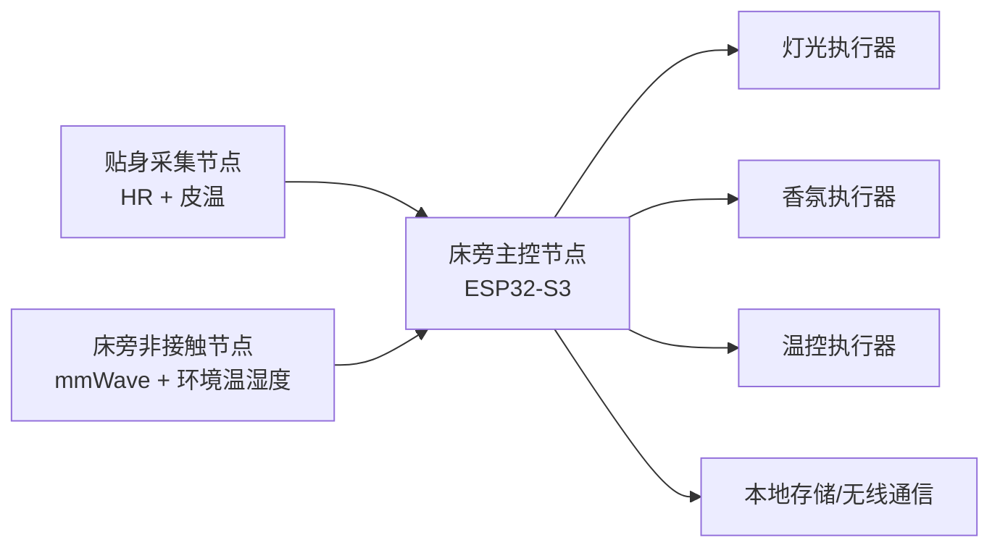

# 睡眠调节系统硬件架构与 BOM

## 1. 硬件目标

本系统需要支持三类能力：

1. 生理与环境数据采集
2. 本地策略推理与安全控制
3. 光源、香氛、温度三类执行器调节

因此硬件设计应围绕以下原则展开：

- 传感稳定优先
- 端侧算力够用即可
- 执行器控制简单、可复现、可标定
- 原型阶段优先跑通闭环，再收敛量产

## 2. 总体硬件架构

推荐采用“两节点 + 三执行器”的结构。

### 2.1 为什么建议两节点

原因如下：

- 呼吸率、体动、存在检测适合用床旁 mmWave
- 心率和皮温更适合贴身采集
- 单一床旁雷达在心率精度上更适合做趋势参考，不适合作为唯一高置信 HR 来源

## 3. 节点划分

### 3.1 床旁主控节点

职责：

- 汇总所有传感器数据
- 运行个体化参数生成
- 运行规则分型器
- 运行 ESP-DL 小模型
- 执行安全层
- 控制灯光、香氛、温度

推荐主控：

- `ESP32-S3-WROOM-1-N8R2`

推荐原因：

- 端侧模型推理足够
- 8MB Flash + 2MB PSRAM，适合 ESP-DL 小模型
- 外设丰富，适合多传感器和多执行器

### 3.2 贴身采集节点

职责：

- 采集更可靠的心率
- 采集皮温
- 通过 BLE/UART 向主控发送数据

推荐方案：

- 小型低功耗子板
- 也可以先在原型阶段直接有线接到主控

### 3.3 床旁非接触节点

职责：

- 采集呼吸率
- 检测人体存在和体动
- 作为睡眠场景的非接触主传感器

推荐方案：

- 60GHz 毫米波模组

## 4. 推荐硬件 BOM

以下是当前最适合原型验证的一版 BOM。

### 4.1 主控与通信

| 类别 | 推荐器件 | 作用 |
|---|---|---|
| 主控 MCU | `ESP32-S3-WROOM-1-N8R2` | 本地推理、控制、通信 |
| 调试板 | `ESP32-S3 DevKit` 同系列 | 原型调试与固件下载 |
| 无线通信 | 主控自带 `Wi‑Fi/BLE` | 数据同步、贴身节点连接 |

### 4.2 生理采集

| 类别 | 推荐器件 | 作用 |
|---|---|---|
| 非接触呼吸/体动 | `MR60BHA2` 或同类 60GHz mmWave | 呼吸率、存在、体动 |
| 心率传感器 | `MAX30102` | 贴身 PPG 心率 |
| 皮温传感器 | `TMP117` | 高精度皮温 |
| 环境温湿度 | `SHT40` | 房间温湿度补偿 |

### 4.3 执行器

| 类别 | 推荐器件 | 作用 |
|---|---|---|
| 灯光 | 双色温 LED 灯带 | 光照与色温调节 |
| 香氛 | 超声雾化模块 / 微型隔膜泵 | 香氛释放 |
| 温控 | 5V 小风扇 | 局部送风降温 |

### 4.4 驱动与电源

| 类别 | 推荐器件 | 作用 |
|---|---|---|
| 风扇/泵驱动 | `DRV8871` | 风扇或泵 PWM 驱动 |
| 低边开关 | `AO3400A` | 小功率开关控制 |
| 降压电源 | 12V -> 5V Buck | 给主控和执行器供电 |
| 主电源 | 12V 适配器 | 系统总供电 |

## 5. 传感器选择建议

### 5.1 呼吸与体动

推荐优先级：

1. `60GHz mmWave`
2. 床垫压力传感器
3. 摄像头方案，不推荐睡眠首版

原因：

- mmWave 非接触
- 隐私更好
- 对呼吸和存在检测更友好

### 5.2 心率

推荐优先级：

1. `MAX30102` 贴身 PPG
2. BLE 胸带，研究验证可用
3. mmWave 心率趋势，仅作为辅助参考

原因：

- 对你当前算法来说，HR 是关键输入
- 首版应优先保证可重复性

### 5.3 温度

建议分两类：

- `skin temp`：用户皮温，参与个体化策略
- `ambient temp/humidity`：环境温湿度，用于补偿控制效果

## 6. 执行器设计建议

### 6.1 光源

推荐首版使用：

- 双色温 LED 灯带

不建议首版上复杂 RGB 灯语，原因是：

- 算法主要需要亮度与暖冷变化
- 双色温更容易建模
- PWM 控制简单

推荐控制参数：

- `light_lux`
- `warm_ratio`
- `fade_speed`

### 6.2 香氛

推荐首版使用：

- 超声雾化模块

可控参数：

- `aroma_level`
- `pulse_duty`
- `burst_duration`

注意：

- 香氛必须有最大累计剂量限制
- 需要设计耗材仓与补液方式

### 6.3 温控

推荐首版使用：

- 低噪风扇局部送风

原因：

- 成本低
- 控制简单
- 风险低于半导体制冷片

可控参数：

- `fan_pwm`
- `target_temp_delta`

## 7. 电源架构

建议电源分为 3 路：

1. `12V` 主电源
2. `5V` 执行器电源
3. `3.3V` 传感器与 MCU 电源

注意事项：

- 主控与模拟传感部分要和执行器电源做隔离与滤波
- 风扇、泵、雾化片属于噪声源，需要单独考虑退耦
- 毫米波模块建议单独稳压与地线规划

## 8. 推荐接口关系

### 8.1 主控连接

| 外设 | 接口 |
|---|---|
| `MAX30102` | `I2C` |
| `TMP117` | `I2C` |
| `SHT40` | `I2C` |
| `MR60BHA2` | `UART` 或模块原生接口 |
| LED 驱动 | `PWM` |
| 风扇驱动 | `PWM` |
| 雾化模块 | `PWM/GPIO` |

### 8.2 建议总线分配

- `I2C0`：温度、湿度、PPG 辅助传感器
- `UART1`：毫米波模块
- `PWM`：灯光、风扇、香氛
- `BLE`：贴身节点数据回传

## 9. 原型阶段 BOM 建议

### 9.1 MVP 版本

如果先追求最短时间跑通闭环，建议：

- `ESP32-S3-WROOM-1-N8R2`
- `MR60BHA2`
- `MAX30102`
- `TMP117`
- `SHT40`
- 双色温灯带
- 5V 风扇
- 5V 雾化模块
- `DRV8871`
- `AO3400A`

这个版本已经能完成：

- 年龄 + 基线个体化
- 实时 `HR/BR/Temp`
- 光/香氛/温度三路调节
- 端侧小模型推理

### 9.2 量产收敛方向

量产时建议：

- 保留 `ESP32-S3`
- 保留 `MAX30102 + TMP117 + SHT40`
- 将开发型 mmWave 套件切换为可直接集成的 mmWave 模块方案
- 自研执行器驱动板

## 10. 与算法框架的映射关系

| 算法模块 | 硬件对应 |
|---|---|
| 个体化引擎 | ESP32-S3 本地参数存储与计算 |
| 状态分型器 | ESP32-S3 本地规则逻辑 |
| 小模型推理 | ESP-DL int8 模型 |
| 安全层 | ESP32-S3 本地控制逻辑 |
| 呼吸/体动输入 | mmWave |
| HR 输入 | MAX30102 |
| 体温输入 | TMP117 |
| 环境补偿 | SHT40 |
| 光动作 | LED 驱动 |
| 香氛动作 | 雾化/泵驱动 |
| 温控动作 | 风扇驱动 |

## 11. 风险与建议

### 11.1 当前最大风险

- 非接触心率精度不足
- 香氛剂量控制一致性
- 温控执行的体感稳定性

### 11.2 对策

- HR 第一版优先贴身采集
- 香氛第一版做开环占空比控制，后面再做闭环
- 温控第一版先用风扇，不先上复杂制冷

## 12. 总结

当前最适合这套个体化睡眠调节策略的硬件方案是：

`ESP32-S3 主控 + mmWave 呼吸/体动 + 贴身 HR/皮温 + 温湿度补偿 + 灯光/香氛/风扇执行器`

这套方案的优点是：

- 结构清晰
- 原型闭环容易跑通
- 与当前算法框架强匹配
- 便于后续收敛到量产版本
