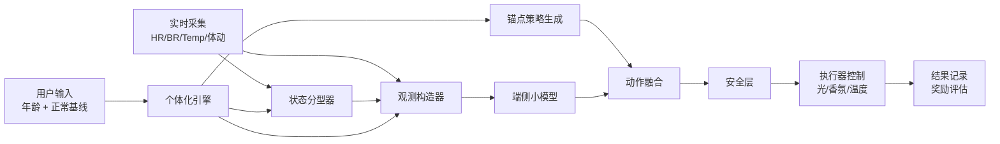

# MVP 技术功能拆解 / Functional Spec

## 1. 文档目标

本文档定义睡眠调节系统 MVP 版本的功能范围、输入输出、模块职责、约束条件与验收标准，用于对齐：

- 产品定义
- 算法实现
- 嵌入式软件
- 硬件原型
- 数据采集与验证

MVP 目标不是一次性实现完整长期学习系统，而是先跑通“采集 -> 分型 -> 策略 -> 执行 -> 反馈”的最小闭环。

## 2. MVP 目标

MVP 版本需要实现以下核心能力：

1. 用户输入年龄和正常状态生理基线
2. 系统采集实时 `HR/BR/Temp` 和基础体动信息
3. 系统识别当前睡前状态 `S1-S6`
4. 系统输出个体化的光源、香氛、温度调节策略
5. 系统本地执行策略并记录过程数据
6. 系统基于入睡时延和睡眠深浅代理生成反馈结果

## 3. MVP 边界

### 3.1 包含范围

- 个体化冷启动
- 睡前状态分型
- 个体化锚点策略生成
- 端侧小模型微调
- 三类执行器控制
- 安全约束
- 单晚数据记录
- 单晚结果评估

### 3.2 不包含范围

- 长期自适应训练闭环自动上线
- 端侧 PPO 训练
- 医疗诊断能力
- 多用户同时使用
- 复杂 App 社交或云端运营功能
- 大规模量产结构优化

## 4. 系统概览



## 5. 用户场景

### 5.1 首次使用

用户首次使用时输入：

- 年龄
- 正常心率
- 正常呼吸率
- 正常体温
- 可选正常 HRV

系统基于输入生成首版个体化参数，并保存为用户画像。

### 5.2 单晚使用

用户准备入睡时：

1. 系统开始采集实时生理数据
2. 系统识别当前睡前状态
3. 系统生成当前阶段的调节策略
4. 系统调节灯光、香氛、温度
5. 系统记录单晚数据和结果

### 5.3 次晨评估

系统生成：

- 入睡时延
- 深睡代理分数
- 夜间唤醒次数
- 单晚奖励分数

## 6. MVP 功能拆解

## 6.1 用户画像与冷启动模块

### 功能目标

根据用户年龄和正常生理基线生成初始个体化参数。

### 输入

- `age`
- `hr_baseline`
- `br_baseline`
- `temp_baseline`
- 可选 `rmssd_baseline`
- 可选 `stillness_baseline`

### 输出

- `age_band`
- 个体化分型阈值
- 个体化目标生理区间
- 个体化安全边界
- 个体化锚点缩放因子

### 功能要求

- 支持首次输入后本地保存
- 支持后续修改和覆盖
- 缺失可选项时可回退到默认配置

### MVP 验收

- 用户输入完整基线后，系统能生成一份 `personalized_strategy`
- 对不同年龄输入，策略参数存在可解释差异

## 6.2 实时数据采集模块

### 功能目标

持续采集睡前与入睡早期的实时生理和环境数据。

### 必选输入

- `HR`
- `BR`
- `Temp`

### 建议输入

- `stillness`
- `BR_irregularity`
- `ambient_temp`
- `ambient_humidity`

### 功能要求

- 支持固定频率采样
- 支持基础去噪
- 支持采样时间戳记录
- 传感器暂时缺失时应保留回退逻辑

### MVP 验收

- 系统可持续记录至少 30 分钟连续采样
- 数据具备统一时间戳
- 采集异常时系统不崩溃

## 6.3 睡前状态分型模块

### 功能目标

根据实时生理信号和个体化阈值，将用户划分到 `S1-S6`。

### 输入

- 实时生理数据
- 用户基线
- 个体化阈值

### 输出

- `state`
- `confidence`
- `rationale`

### 功能要求

- 至少支持 `S1-S6` 六类状态
- 缺少 `HRV` 或呼吸不规则度时进入 reduced-feature 模式
- `confidence < 0.5` 时回退 `S4`
- `S6` 进入保守模式

### MVP 验收

- 在模拟输入下可正确输出六类状态之一
- 在缺失部分特征时仍能给出回退结果

## 6.4 个体化锚点策略模块

### 功能目标

根据用户状态和睡眠阶段输出基础动作策略。

### 输入

- `state`
- `phase`
- `personalized_strategy`

### 输出

- `anchor_light_lux`
- `anchor_aroma_level`
- `anchor_temp_delta_c`

### 功能要求

- 支持 `PRE_SLEEP` 和 `INDUCTION` 两阶段
- 支持按用户画像缩放光照、香氛、温控参数
- 支持高龄和敏感用户更保守的参数

### MVP 验收

- 不同状态与阶段返回不同锚点策略
- 个体化参数可影响输出结果

## 6.5 端侧小模型微调模块

### 功能目标

对锚点策略输出小范围微调量。

### 输入

- 观测向量 `observation`

### 输出

- `light_delta`
- `aroma_delta`
- `temp_delta_c`

### 功能要求

- 模型为轻量 MLP
- 端侧仅做前向推理
- 支持 `int8` 量化
- 不要求 MVP 阶段必须是最终训练好的最优模型，可先接占位模型或规则近似模型

### 推荐规格

- `input_dim = 20`
- `hidden = [32, 16]`
- `output_dim = 3`

### MVP 验收

- 模型输入输出链路可打通
- 推理结果可参与最终动作融合

## 6.6 动作融合与安全层

### 功能目标

将锚点动作和小模型输出融合，并通过安全约束裁剪后发送到执行器。

### 输入

- 锚点动作
- 模型微调量
- 用户安全边界
- 上一步动作

### 输出

- `final_light_lux`
- `final_aroma_level`
- `final_temp_delta_c`
- `safety_violated`

### 功能要求

- 光照范围限制
- 香氛上限限制
- 温度变化上下限限制
- 单步变化率限制
- `S6` 状态下强制保守策略

### MVP 验收

- 越界动作可被裁剪
- 快速跳变动作可被限制
- 保留安全裁剪日志

## 6.7 执行器控制模块

### 功能目标

将最终策略映射到灯光、香氛和温控执行器。

### 输入

- 最终动作参数

### 输出

- PWM 或 GPIO 控制信号
- 设备执行状态

### 功能要求

- 光源亮度可调
- 香氛启停或占空比可调
- 风扇转速可调
- 支持最小化噪声和突变

### MVP 验收

- 三类执行器能独立受控
- 控制信号与日志记录一致

## 6.8 数据记录模块

### 功能目标

记录用户输入、采样数据、分型结果、策略输出、执行结果和单晚结果。

### 必记数据

- 用户画像
- 基线数据
- 实时采样流
- 状态分型结果
- 策略输出
- 安全裁剪记录
- 单晚结果

### MVP 验收

- 单晚全过程可以复盘
- 数据字段完整可用于离线分析

## 6.9 单晚评估与奖励模块

### 功能目标

基于当晚生理变化和最终睡眠结果生成单晚效果评估。

### 输入

- 实时生理数据
- 单晚结果

### 输出

- `dense_reward`
- `terminal_reward`
- `episode_total_reward`

### 关键指标

- `sleep_latency_min`
- `deep_sleep_ratio` 或 `deep_sleep_proxy`
- `wake_count`
- `micro_arousal_count`

### MVP 验收

- 系统能输出单晚结果摘要
- 能生成可比较的奖励值

## 7. 睡眠阶段定义

MVP 阶段先支持两个核心阶段：

- `PRE_SLEEP`
- `INDUCTION`

可预留扩展字段：

- `N1_N2`
- `N3`
- `REM`
- `WAKE`

### 阶段切换要求

- 用户进入系统后默认 `PRE_SLEEP`
- 当满足入睡前诱导条件时切换到 `INDUCTION`
- MVP 阶段不强制做完整睡眠分期

## 8. 数据格式要求

## 8.1 用户画像输入 JSON

```json
{
  "user_id": "u_001",
  "age": 29,
  "stress_trait": 0.7,
  "temperature_sensitivity": 0.5,
  "aroma_sensitivity": 0.4
}
```

## 8.2 生理基线 JSON

```json
{
  "user_id": "u_001",
  "hr_bpm": 68.0,
  "br_bpm": 15.0,
  "skin_temp_c": 36.4,
  "rmssd_ms": 42.0,
  "stillness": 0.78
}
```

## 8.3 实时采样 JSON

```json
{
  "timestamp": "2026-05-20T22:10:00+08:00",
  "user_id": "u_001",
  "hr_bpm": 74.0,
  "br_bpm": 17.0,
  "skin_temp_c": 36.3,
  "br_irregularity": 0.12,
  "stillness": 0.66
}
```

## 8.4 分型结果 JSON

```json
{
  "timestamp": "2026-05-20T22:12:00+08:00",
  "user_id": "u_001",
  "phase": "pre_sleep",
  "state": "S2",
  "confidence": 0.78,
  "rationale": "personalized high arousal pattern"
}
```

## 8.5 策略输出 JSON

```json
{
  "timestamp": "2026-05-20T22:12:05+08:00",
  "user_id": "u_001",
  "anchor_action": {
    "light_lux": 2.5,
    "aroma_level": 0.40,
    "temp_delta_c": -1.2
  },
  "delta_action": {
    "light_lux": -0.2,
    "aroma_level": 0.05,
    "temp_delta_c": -0.1
  },
  "final_action": {
    "light_lux": 2.3,
    "aroma_level": 0.45,
    "temp_delta_c": -1.3
  },
  "safety_violated": false
}
```

## 8.6 单晚结果 JSON

```json
{
  "date": "2026-05-20",
  "user_id": "u_001",
  "sleep_latency_min": 17.0,
  "deep_sleep_proxy": 0.71,
  "wake_count": 1,
  "micro_arousal_count": 2,
  "episode_total_reward": 0.76
}
```

## 9. 硬件功能映射

| 功能模块 | 硬件要求 |
|---|---|
| 用户画像与基线存储 | 主控本地存储 |
| HR 采集 | 贴身 PPG |
| BR/体动采集 | mmWave |
| Temp 采集 | 皮温传感器 |
| 状态分型 | ESP32-S3 本地规则逻辑 |
| 小模型推理 | ESP-DL int8 MLP |
| 灯光控制 | PWM 驱动 LED |
| 香氛控制 | GPIO/PWM 驱动雾化器 |
| 温控控制 | PWM 驱动风扇 |

## 10. 非功能要求

### 10.1 性能

- 策略决策延迟建议小于 `500 ms`
- 端侧推理时间建议小于 `100 ms`
- 执行动作更新周期建议 `30s ~ 180s`

### 10.2 稳定性

- 单个传感器异常不应导致系统退出
- 应支持默认回退状态和安全模式

### 10.3 安全性

- 所有执行器输出必须经过安全裁剪
- `S6` 必须进入保守模式

## 11. MVP 验收标准

MVP 通过的最小标准：

1. 用户可完成年龄和基线录入
2. 系统可连续采集 `HR/BR/Temp`
3. 系统可输出 `S1-S6` 之一
4. 系统可生成个体化策略
5. 系统可控制灯光、香氛、温度至少各一种执行器
6. 系统可记录单晚完整过程
7. 系统可输出入睡时延和深睡代理结果

## 12. 开发优先级

### P0

- 用户画像输入
- 基线存储
- 实时采集
- 状态分型
- 锚点策略
- 安全层
- 执行器控制
- 数据记录
