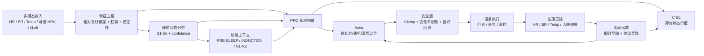

# 基于 PPO 的多模态睡眠调节算法框架

## 1. 目标定义

目标是在用户睡前 `-60min ~ 入睡后早期阶段` 内，基于多模态生理信号动态调节光源、香氛与温度，降低入睡时延、提升睡眠深度，并在安全约束下形成可持续个体化优化闭环。

结合定义书《用户睡前生理状态分型与干预映射定义书_v0.1》，推荐采用：

- 上层：规则/监督混合的睡前状态分型器 `S1-S6`
- 下层：带安全约束的连续控制策略 `Safe-Constrained PPO`
- 训练模式：`规则冷启动 -> 离线仿真训练 -> 小流量在线微调`

## 2. 总体架构



## 3. 状态建模

### 3.1 输入模态

核心输入：

- 心率 `HR`
- 呼吸率 `BR`
- 体温 `Temp`

建议扩展输入：

- 心率变异性 `RMSSD/SDNN`
- 呼吸不规则度 `BR_irregularity`
- 体动/静止度 `stillness`
- 用户主观压力或认知负荷

说明：

- 如果当前硬件只能稳定提供 `HR/BR/Temp`，PPO 仍可工作，但 `S1/S3`、`S4/S5` 的区分度会下降。
- 建议把 `HRV` 视为从心搏间期可推导的优先补充特征。

### 3.2 状态分型

沿用定义书中的六类睡前状态：

- `S1`: 高交感/焦虑
- `S2`: 高觉醒/亢奋
- `S3`: 中度反刍
- `S4`: 低唤醒平静，作为基准态
- `S5`: 低唤醒疲惫
- `S6`: 病理性失眠风险

推荐分层使用：

- `State Classifier` 决定用户属于哪一类 arousal pattern
- `PPO Policy` 在该状态内输出连续动作增量 `alpha`

这能避免纯 RL 直接从稀疏回报中学习状态语义，提升早期收敛速度与可解释性。

### 3.3 观测向量

在时间步 `t`，构造观测：

```text
o_t = [
  HR_t, BR_t, Temp_t,
  dHR_t, dBR_t, dTemp_t,
  HR_dev_7d, BR_dev_7d, Temp_dev_7d,
  BR_stability_t, HR_stability_t,
  sleep_phase_token,
  state_one_hot(S1-S6),
  state_confidence,
  last_action_light,
  last_action_aroma,
  last_action_temp,
  elapsed_minutes,
  user_profile_embedding
]
```

其中：

- `*_dev_7d` 表示相对个人 7 日基线偏差
- `sleep_phase_token` 表示当前阶段，如 `PRE_SLEEP`、`INDUCTION`
- `last_action_*` 用于抑制动作抖动

## 4. 动作空间设计

将控制动作建模为连续向量：

```text
a_t = [
  light_intensity_delta,
  light_rhythm_delta,
  aroma_intensity_delta,
  aroma_duty_cycle_delta,
  target_temperature_delta
]
```

对应设备控制：

- 光源：亮度、节律频率、渐暗速度
- 香氛：浓度、喷发脉冲占空比
- 温度：枕温、床面温度或局部送风目标温度

推荐控制方式：

- `PRE_SLEEP` 以分钟级动作更新，间隔 `180s`
- `INDUCTION` 以更细粒度更新，间隔 `30-60s`
- 入睡后锁定 `alpha`，只允许锚点矩阵随睡眠阶段切换

## 5. PPO 设计

### 5.1 为什么选择 PPO

PPO 适合该任务，原因如下：

- 支持连续动作控制
- 在线微调稳定性较好
- 易于加入安全约束和动作变化惩罚
- 可在离线仿真环境中先训练，再做有限在线更新

### 5.2 策略结构

推荐使用双塔时序编码器 + 融合层：

- 生理塔：编码 `HR/BR/Temp` 时序窗口
- 上下文塔：编码阶段、用户画像、上次动作、分型标签
- 融合层：拼接后进入 Actor/Critic MLP

建议网络：

- 时序编码：`GRU` 或 `Temporal Transformer`
- Actor 输出：多维高斯分布 `mu, sigma`
- Critic 输出：状态价值 `V(o_t)`
- 安全 Critic 可选：预测约束代价 `C(o_t)`

### 5.3 分层控制

推荐使用“规则分型 + PPO 细调”的层级控制：

```text
final_action = anchor_action(phase, state) + ppo_delta_action(o_t)
```

其中：

- `anchor_action` 来自定义书中的基础映射表
- `ppo_delta_action` 仅在允许范围内微调

这样做的好处：

- 保留专家先验
- 缩小 RL 搜索空间
- 降低早期策略发散风险

## 6. 奖励函数设计

用户要求“以用户生理数据作为策略评价标准，用户入睡的快慢和睡眠的深浅作为 reward”，因此推荐采用“稠密奖励 + 终局奖励”。

### 6.1 即时稠密奖励

对每个控制步，定义：

```text
r_dense_t =
  w1 * HR_relax_gain_t +
  w2 * BR_regular_gain_t +
  w3 * Temp_comfort_gain_t +
  w4 * stillness_gain_t -
  w5 * action_jitter_cost_t -
  w6 * safety_violation_cost_t
```

具体解释：

- `HR_relax_gain_t`：心率向个体睡前放松区间收敛时为正
- `BR_regular_gain_t`：呼吸趋于平稳、慢而规则时为正
- `Temp_comfort_gain_t`：体温/局部温控进入舒适入睡区间时为正
- `stillness_gain_t`：翻动减少、静止度提高时为正
- `action_jitter_cost_t`：设备频繁变化惩罚
- `safety_violation_cost_t`：越界或临近越界惩罚

### 6.2 终局奖励

在一个 episode 结束时定义：

```text
r_terminal =
  k1 * f_sleep_latency +
  k2 * f_sleep_depth +
  k3 * f_sleep_continuity -
  k4 * f_micro_awakenings
```

建议落地为：

- `f_sleep_latency = - normalize(SL_min)`，入睡越快越高
- `f_sleep_depth = normalize(N3_ratio or deep_sleep_proxy)`，越深越高
- `f_sleep_continuity = - normalize(wake_count + WASO)`
- `f_micro_awakenings` 反映早期微觉醒次数

### 6.3 当下硬件下的睡眠深浅代理

若暂时没有 PSG/EEG，可采用深睡代理指标：

- 低而稳定的 `HR`
- 低频稳定 `BR`
- 低体动
- HR 与 BR 耦合稳定性
- 温控后生理波动减小

可训练一个 `sleep_depth_estimator` 作为辅助模型输出 `deep_sleep_proxy in [0,1]`。

### 6.4 总奖励

```text
R = sum_t(gamma^t * r_dense_t) + lambda_terminal * r_terminal
```

建议初始权重：

- `lambda_terminal` 远高于单步稠密奖励
- 训练早期提升稠密奖励权重，避免只有终局奖励导致学习过慢

## 7. 安全约束设计

该任务必须采用约束强化学习，而不是裸 PPO。

### 7.1 硬约束

结合定义书与设备约束，建议至少设置：

- 光照 `lux <= 5`，尤其在诱导阶段
- 温控不超过硬件安全阈值
- 单次温度变化率受限，避免突然冷热刺激
- 香氛浓度、占空比和累计暴露量受限
- `S6` 状态禁用激进策略，直接进入保守/医疗提示模式

### 7.2 软约束

加入代价函数：

```text
c_t =
  c1 * near_limit_penalty +
  c2 * large_delta_penalty +
  c3 * user_discomfort_penalty
```

训练时使用：

- `PPO-Lagrangian`
- 或 `reward - beta * cost`

## 8. 环境与训练方案

### 8.1 Episode 定义

一个 episode 对应“一晚睡前到入睡后早期”的控制过程：

- 起点：用户上床并进入稳定检测
- 终点：成功入睡、超时未睡、或触发安全回退

### 8.2 不建议直接真人在线探索

直接对真实用户做在线探索风险太高，建议三阶段：

1. 规则策略运行，采集多晚数据
2. 建立生理响应仿真环境 `sleep digital twin`
3. 在仿真环境中训练 PPO，再小流量上线

### 8.3 仿真环境

推荐用一个环境模型近似：

```text
P(s_{t+1} | s_t, a_t, user_context)
```

可采用：

- `GRU/Transformer World Model`
- 或基于回归器的多头预测器

预测目标：

- 下一时刻 `HR/BR/Temp`
- 入睡概率 `p_sleep_onset`
- 深睡代理 `deep_sleep_proxy`
- 微觉醒风险 `p_micro_arousal`

### 8.4 训练流程

1. 用规则策略和历史回放构建数据集
2. 训练状态分型器与睡眠深度估计器
3. 训练环境模型
4. 在仿真环境中训练 Safe PPO
5. 与规则策略做离线对比评估
6. 小流量 A/B 测试在线部署
7. 周期性重训与个体化微调

## 9. 结合定义书的最终控制逻辑

### 9.1 冷启动阶段

- 基于规则引擎得到 `S1-S6`
- 若置信度低，则回退 `S4`
- 从映射表取出该状态的锚点动作
- 当只有 `HR/BR/Temp` 三路输入时，分型器进入 reduced-feature 模式，只输出高置信的 `S1/S2/S5` 候选，否则默认回退 `S4`

### 9.2 PPO 细调阶段

PPO 不直接覆盖专家规则，而是在状态内输出偏移量：

```text
alpha_t = PPO(o_t)
u_t = clamp(anchor_u_t + alpha_t)
```

### 9.3 入睡后锁定

一旦触发 `INDUCTION -> N1/N2`：

- 锁定状态标签
- 锁定 PPO 学到的个体化偏移系数 `alpha`
- 后续阶段只跟随锚点矩阵切换，不再频繁探索

这与定义书中“入睡后分型不再切换，但偏移系数持续生效”的原则一致。

## 10. 关键模型接口

```python
state, confidence = classify_user_state(obs_window, baseline)
anchor_action = get_anchor_action(state=state, phase=phase)
ppo_delta = policy.act(observation)
safe_action = safety_layer(anchor_action + ppo_delta)
reward = reward_fn(physiology, sleep_outcome, safe_action)
```

## 11. 推荐指标体系

离线指标：

- 状态分类准确率 / F1
- 环境模型一步预测误差
- 奖励估计误差
- 策略对基线规则的离线优势 `off-policy evaluation`

在线指标：

- 入睡时延 `SL`
- 深睡代理得分
- 夜间觉醒次数
- 次晨主观评分
- 设备干预平滑度
- 安全事件率

## 12. 落地建议

### Phase 1

- 先做规则分型 + 锚点参数表
- PPO 只学习小范围偏移量
- 以 `HR/BR/Temp` 为核心输入

### Phase 2

- 补充 `HRV`、体动、主观认知输入
- 建立睡眠深度估计器
- 开始仿真训练与小流量在线微调

### Phase 3

- 发展为个体化上下文策略
- 做用户分群 + Meta-RL / Contextual PPO
- 融入多夜历史与长期睡眠债建模

## 13. 结论

最适合当前业务场景的不是“纯 PPO 端到端控制”，而是：

`睡前规则分型 + 专家锚点动作 + 安全约束 PPO 微调 + 入睡后锁定 alpha`

这个框架兼顾了：

- 可解释性
- 工程可落地性
- 安全性
- 个体化优化能力

如果后续要进入代码实现，优先顺序建议是：

1. 先搭状态分型器和奖励计算器
2. 再搭设备约束环境
3. 最后接 PPO 训练和在线推理服务
